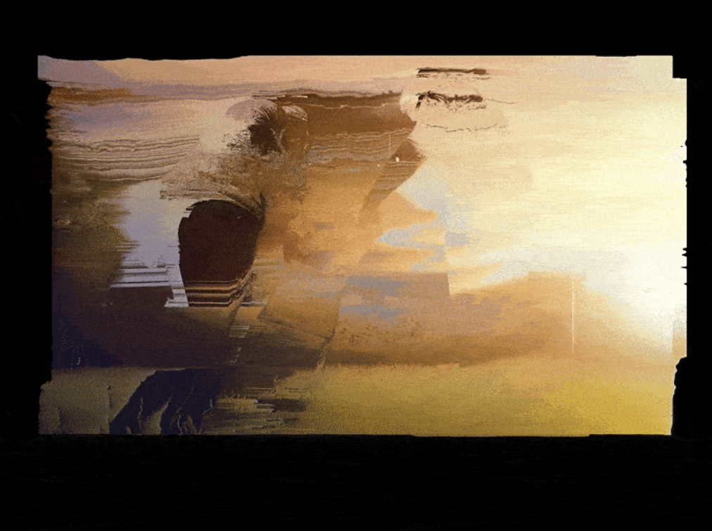
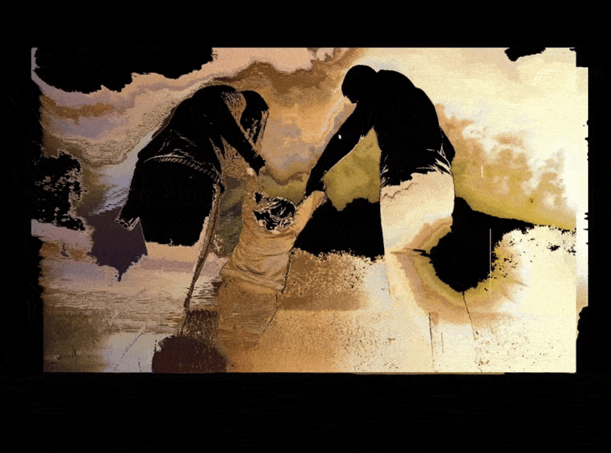
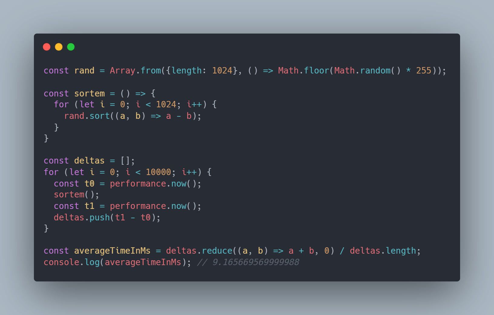
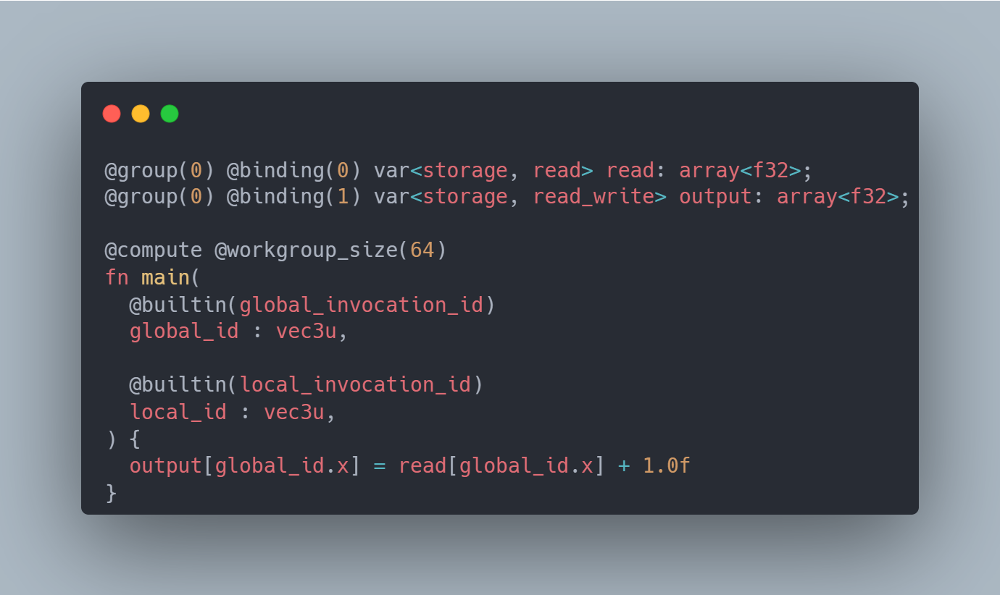
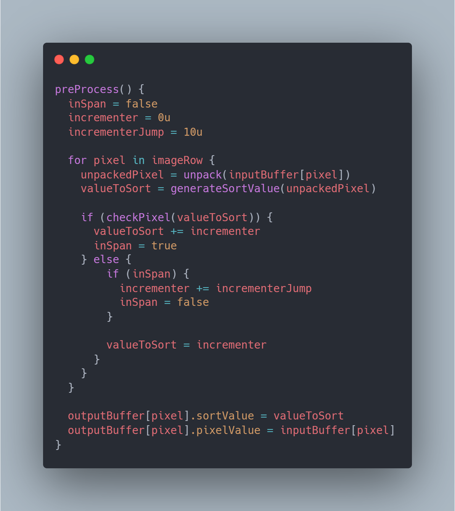
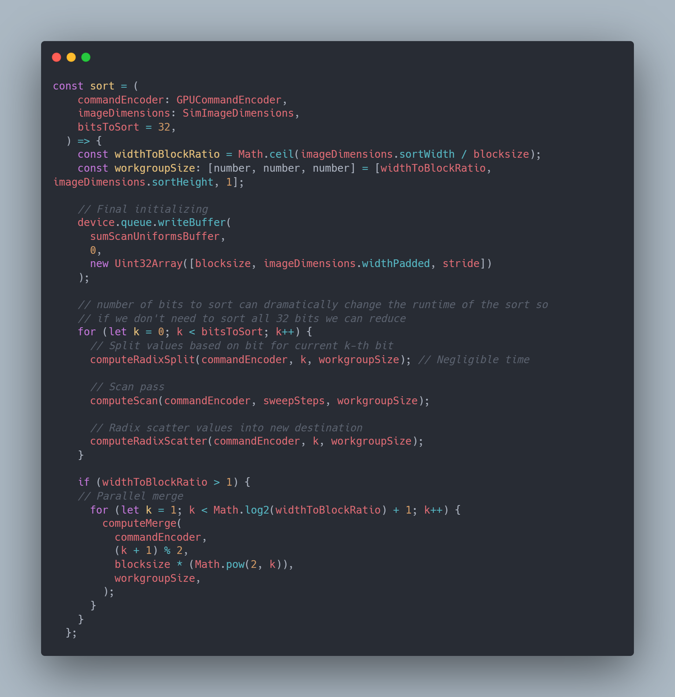

# yjin0588_9103_tut3

# Quiz 8

## Part 1: Imaging Technique Inspiration

**Imaging technology:** Pixel Sorting  

**Inspiration:** [Link](https://dribbble.com/shots/3577112-Pixel-sorting-experiment)

**Note:**  
Utilizing the work's horizontally fractured strips and color gradations, I will employ pixel remapping techniques, stretching pixels along scan lines through brightness and hue, which continuously change over time, creating a slowly moving, cyclical effect of fragmentation, reassembly, and refracture.

Pixel remapping techniques facilitate parameterization and abstraction of the design work, such as direction, threshold, intensity, and real-time interactivity. This allows for dynamic and controllable manipulation while preserving the original work's abstract composition. I will choose this imaging method because it allows me to easily replicate and expand the visual effects of the final project in code.

  

## Part 2: Coding Technique Exploration

**Note:**  
This code uses GPU parallel processing to sort pixel values ​​bit by bit using a radix algorithm. By controlling how pixels are split, scanned, and merged (`computeRadixSplit`, `computeScan`, `computeMerge`), it efficiently reorders image data based on brightness or color. This structured pixel rearrangement produces the characteristic glitches and artifacts of pixel sorting, achieving the desired abstract visual effect in real time.

**Existing code & Explaination:** [Link](https://lukecochrane.com/blog/pixel-sorting?utm_source=chatgpt.com)

  
  
  
